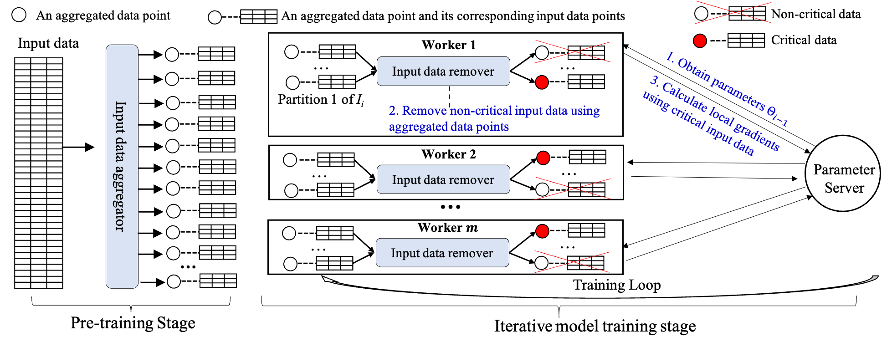
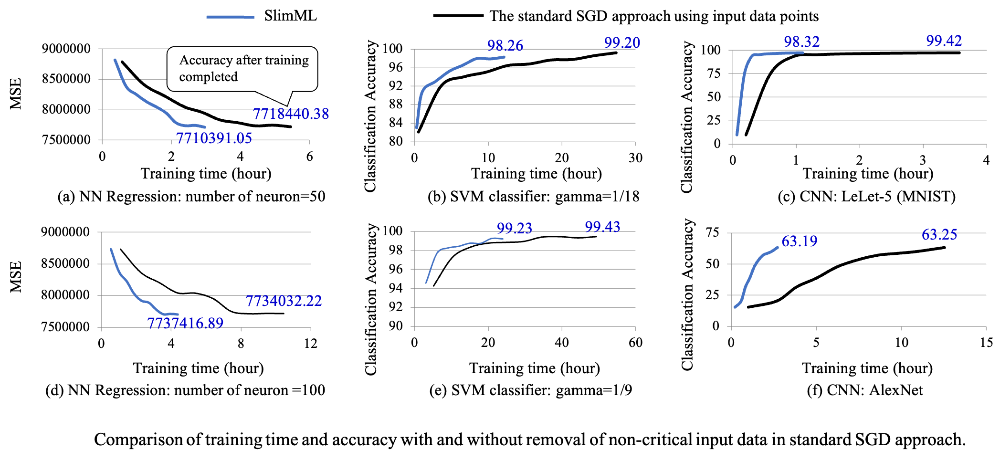

# SlimML

[SlimML: Removing Non-Critical Input Data in Large-Scale Iterative Machine Learning](https://ieeexplore.ieee.org/abstract/document/8890886/)

SlimML -- A slim learning framework, which trains the ML models only on the critical data and thus significantly improves training performance.


- [SlimML](#slimml)
	- [1. 介绍](#1-介绍)
	- [2. 代码和环境配置](#2-代码和环境配置)
		- [2.0 代码打包](#20-代码打包)
		- [2.1 代码提交](#21-代码提交)
		- [2.2 代码结构](#22-代码结构)
		- [2.3 环境配置](#23-环境配置)
	- [Example](#example)
## 1. 介绍

许多大规模机器学习应用(如神经网络(NN)、支持向量机(SVM)和卷积神经网络(CNN))的核心是迭代地处理海量数据集以完成模型训练。大量旨在加速机器学习训练的研究普遍假设各个数据样本与模型参数更新等效相关。然而一个显著的事实是不同的数据样本对模型参数更新具有不同的影响。



SlimML是一个基于参数服务器架构的训练优化框架，它通过评估数据样本对模型参数更新的影响大小来选择少量关键的数据进行训练，从而提高系统训练性能。为了减少识别关键数据的额外开销，SlimML在每个迭代中利用少量聚合数据点来近似评估原始输入数据样本的重要性。SlimML不改变正常的训练过程，可以与SGD、Adam等优化算法无缝集成。仅需要改变几行代码，就可以获得SlimML带来的训练性能提升。


## 2. 代码和环境配置

SlimML基于分布式深度学习训练框架 [BigDL](https://github.com/intel-analytics/BigDL) 实现，运行于 [Spark](https://spark.apache.org/) 集群之上，支持 `Local, Standalone` 和 `Yarn` 提交。

### 2.0 代码打包

使用 IntelliJ IDEA 打包时注意将 Spark 和 BigDL 相关的依赖加入 Jar 包中，具体如下所示：

```xml
<component name="ArtifactManager">
  <artifact type="jar" name="slimml:jar">
    <output-path>$PROJECT_DIR$/out/artifacts/slimml_jar</output-path>
    <root id="archive" name="slimml.jar">
      <element id="module-output" name="slimml" />
      <element id="extracted-dir" path="$MAVEN_REPOSITORY$/com/github/scopt/scopt_2.11/3.2.0/scopt_2.11-3.2.0.jar" path-in-jar="/" />
      <element id="extracted-dir" path="$MAVEN_REPOSITORY$/com/intel/analytics/bigdl/core/dist/all/0.8.0/all-0.8.0.jar" path-in-jar="/" />
      <element id="extracted-dir" path="$MAVEN_REPOSITORY$/com/intel/analytics/bigdl/bigdl-SPARK_2.3/0.8.0/bigdl-SPARK_2.3-0.8.0.jar" path-in-jar="/" />
      <element id="extracted-dir" path="$MAVEN_REPOSITORY$/com/intel/analytics/bigdl/spark-version/2.0-SPARK_2.3/0.8.0/2.0-SPARK_2.3-0.8.0.jar" path-in-jar="/" />
    </root>
  </artifact>
</component>
```

### 2.1 代码提交

将打包好的 `SlimML.jar` 提交到 Spark 集群中运行，提交时需要设置需要运行的主类和其它相关参数。

```bash
#!/usr/bin/env bash

jarPath="hdfs:///jars/SlimML.jar"
mainClass="slpart.models.lenet.TrainMnist"

dataPath="hdfs:///dataset/mnist"

zScore="true"
useComp="true"
getGradient="true"
upBound=53

master="spark://master:7077"
maxEpoch=200
batchSize=256
learningRate=0.05

notEpoch=5
taskDel="true"
taskStrategy="fixedratio"
taskRatio=0.90

appName="lenet-mnist-${taskRatio}"

loadSnapshot="false"
modelPath="lenet-mnist.model"

storeInitModel="false"
storeInitModelPath="lenet-mnist.model"

storeTrainedModel="false"
storeTrainedModelPath="trained-lenet-mnist.model"

echo "training start"
spark-submit \
	--master ${master} \
	--deploy-mode "client"
	--driver-memory 8g \
	--executor-memory 16g \
	--total-executor-cores 20 \
	--driver-class-path ${jarPath} \
	--class ${mainClass} \
	${jarPath} \
	--appName ${appName} \
	--folder ${dataPath} \
	--zScore ${zScore} \
	--useComp ${useComp} \
	--getGradient ${getGradient} \
	--upBound ${upBound} \
	--maxEpoch ${maxEpoch} \
	--batchSize ${batchSize} \
	--learningRate ${learningRate} \
	--notEpoch ${notEpoch} \
	--taskDel ${taskDel} \
	--taskStrategy ${taskStrategy} \
	--taskRatio ${taskRatio} \
	--loadSnapshot ${loadSnapshot} \
	--model ${modelPath} \
	--storeInitModel ${storeInitModel} \
	--storeInitModelPath ${storeInitModelPath} \
	--storeTrainedModel ${storeTrainedModel} \
	--storeTrainedModelPath ${storeTrainedModelPath}
```

- 相关参数解释

下表列出了一些必要的参数及其解释，其中许多参数都设置了默认值，运行时刻根据需要自行调整。更多其它参数可以在源码中找到。

|Property|Default|Description|
|:----|:----|:----|
|--appName|"lenet-mnist"|应用名称|
|--folder|-|数据集目录|
|--zScore|"true"|是否进行数据集规范化 "true" \| "false"|
|--useComp|"true"|是否需要生成聚合数据点 "true" \| "false" 非关键数据识别和移除是必须设置为 "true".|
|--getGradient|"true"|使用梯度范数作为关键性度量指标 true" \| "false". false使用损失值作为度量指标|
|--upBound|53|压缩比例|
|--maxEpoch|200|训练周期数|
|--batchSize|256|批量大小|
|--learningRate|0.05|学习率|
|--notEpoch|5|训练的前`notEpoch` 周期不进行非关键数据删除|
|--taskDel|"true"|是否要删除非关键数据："true" \| "false"|
|--taskStrategy|"fixedratio"|非关键数据阈值：固定比例|
|--taskRatio|0.9|非关键数据阈值：`(0.0, 1.0)`|
|--loadSnapshot|"false"|是否加载初始模型："true" \| "false"|
|--model|-|初始模型路径|
|--storeInitModel|"false"|保存初始模型："true" \| "false"|
|--storeInitModelPath|-|初始模型保存路径|
|--storeTrainedModel|"false"|是否保存训练后的模型："true" \| "false"|
|--storeTrainedModelPath|-|模型保存路径|

### 2.2 代码结构

SlimML 对 BigDL 的分布式优化器 `com.intel.analytics.bigdl.optim.DistriOptimizer` 进行了修改，因此只需要引入相关的类即可。

```scala

import com.intel.analytics.bigdl.optim._
import com.intel.analytics.bigdl.utils._
import com.intel.analytics.bigdl.numeric.NumericFloat
```

在 Spark 上运行 SlimML 需要如下几个步骤，包括初始化 Spark 上下文和 BigDL 执行引擎、准备训练集和模型、配置优化器等几个关键步骤。

1. 初始化Spark上下文和BigDL执行引擎

```scala
val conf = Engine.createSparkConf()
	       .setAppName(param.appName)
val sc = new SparkContext(conf)
Engine.init
```

2. 加载数据集，SlimML需要生成聚合数据点

```scala
val trainSamples = Mnist.trainSamples(param.folder,sc,param.classes,
	        param.zScore,param.useComp,param.itqbitN,param.itqitN,param.itqratioN,
	        param.upBound,param.splitN,param.isSparse)
val validationSamples = Mnist.validationSamples(param.folder,sc,param.zScore)
	
```

3. 构建或加载模型

```scala
val model = if(param.loadSnapshot && param.modelSnapshot.isDefined){
	        Module.load[Float](param.modelSnapshot.get)
	      }
	      else{
	        LeNet(param.classes)
	  }
```

4. 设置优化算法

```scala
val optimMethod = if(param.loadSnapshot && param.stateSnapshot.isDefined){
 OptimMethod.load[Float](param.stateSnapshot.get)
}
else{
 param.optMethod match {
   case "adam" => new Adam[Float](learningRate = param.learningRate,learningRateDecay = param.learningRateDecay)
   case "adadelta" => new Adadelta[Float]()
   case "rmsprop" => new RMSprop[Float](param.learningRate,param.learningRateDecay)
   case "ftrl" => new Ftrl[Float](param.learningRate)
   case _ => new SGD[Float](learningRate = param.learningRate,learningRateDecay = param.learningRateDecay,
     weightDecay = param.weightDecay,momentum = param.momentum,
     dampening = param.dampening,nesterov = param.nesterov)
 }
}
```

5. 配置BigDL训练优化器

```scala
val optimizer = Optimizer(
	        model = model,
	        sampleRDD = trainSamples,
	        criterion = ClassNLLCriterion[Float](),
	        batchSize = param.batchSize
		)
```

6. 配置非关键数据识别和删除选项

```scala
val prestate = T(("taskDel",param.taskDel),
	        ("taskStrategy",param.taskStrategy.trim.toLowerCase()),
	        ("taskRatio",param.taskRatio),
	        ("taskDrop",param.taskDrop),
	
	        ("epochDel",param.epochDel),
	        ("epochStrategy",param.epochStrategy.trim().toLowerCase()),
	        ("epochRatio",param.epochRatio),
	        ("epochDrop",param.epochDrop),
	
	        ("notIteration",param.notIteration),
	        ("notEpoch",param.notEpoch),
	        ("layerName","conv_1"),
	        ("gradName","gradWeight"),
	
	        ("useComp",param.useComp),
	        ("onlyComp",param.onlyComp),
	        ("getGradient",param.getGradient)
	      )
 // set user defined state
 optimizer.setState(prestate)
```

7. 启动训练

配置完成后调用 `optimizer.optimize()` 方法即可返回训练好的模型。

```scala
optimizer.setValidation(
	        trigger = Trigger.everyEpoch,
	        sampleRDD = validationSamples,
	        vMethods = Array(new Top1Accuracy[Float](),new Top5Accuracy[Float](),new Loss[Float]()),
	        batchSize = param.batchSize
	      )
optimizer.setOptimMethod(optimMethod)
optimizer.setEndWhen(Trigger.maxEpoch(param.maxEpoch))

// 开始训练
val trainedModel = optimizer.optimize()
```

### 2.3 环境配置

* Requirements

|Library|URL|
|:----|:----|
|JDK1.8.0|[https://www.oracle.com/technetwork/java/javase/downloads/jdk8-downloads-2133151.html](https://www.oracle.com/technetwork/java/javase/downloads/jdk8-downloads-2133151.html)|
|Scala 2.11.8|[https://www.scala-lang.org/download/2.11.8.html](https://www.scala-lang.org/download/2.11.8.html)|
|Spark 2.3.1|[http://spark.apache.org/news/spark-2-3-1-released.html](http://spark.apache.org/news/spark-2-3-1-released.html)|
|BigDL 0.8.0|[https://bigdl-project.github.io/0.8.0/#release-download/](https://bigdl-project.github.io/0.8.0/#release-download/)|
|Hadoop 2.7.7（optional）|[https://hadoop.apache.org/releases.html](https://hadoop.apache.org/releases.html)|

1. HDFS集群搭建
2. Spark集群搭建
3. BigDL 编译

## Example

- LeNet + MNIST
使用 LeNet 在 MNIST 数据集上进行测试，测试集群为具有 10 个工作节点的 Spark 集群。对于 Baseline（生成聚合数据点且不进行冗余数据识别和移除）训练参数设置为`useComp="false",getGradient="false" and taskDel="false"`。批量大小设置为 13568（256*53=13568）。

冗余数据识别阈值`(0.1 to 0.9,step is 0.1)`，参数设置为`useComp="true",upBound=53,getGradient="true",taskDel="true",taskStrategy="fixedratio" and taskRatio= 0.1 to 0.9`，前 5 个 Epoch 不进行冗余数据删除`notEpoch=5`。批量大小设置为 256。

训练优化算法设置为 SGD 且`learningRate=0.05 and zScore="true"`。结果如下表所示：

|Type|batchSize|Top1Accuracy|CostTime/seconds|
|:----|:----|:----|:----|
|baseline|13568|95.72%|905.198|
|0.1|256|95.87%|913.571|
|0.2|256|95.93%|833.519|
|0.3|256|95.80%|766.056|
|0.4|256|95.82%|701.310|
|0.5|256|95.72%|632.422|
|0.6|256|95.87%|546.229|
|0.7|256|95.70%|483.426|
|0.8|256|95.76%|405.451|
|0.9|256|95.48%|335.979|

- 其它测试结果

下图是在 NN 回归、SVM 分类算法和 CNN 上的测试结果，具体请参考 [SlimML: Removing Non-Critical Input Data in Large-Scale Iterative Machine Learning](https://ieeexplore.ieee.org/abstract/document/8890886/)

